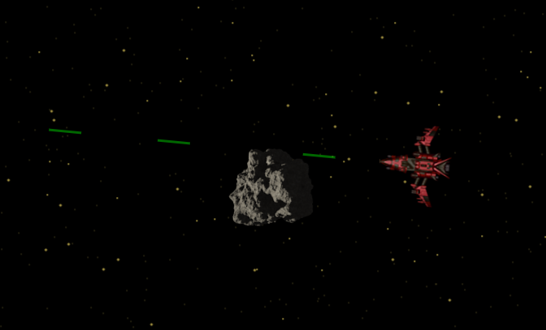

# Spaceship with Parallax effect

https://spaceship-parallax.netlify.app

Navigate a spaceship through space. The stars show a parallax effect. Avoid the asteroids. You can shoot them with lasers.

This is a demonstration how to use multiple HTML canvases and animated sprites with JavaScript (see also [this repository](https://github.com/ScriptRaccoon/Sprite-Animation)).

The image of the idle spaceship comes from https://opengameart.org/content/spaceship-fighter-ipod1. The images of the rotating asteroid come from https://opengameart.org/content/asteroid-l.
